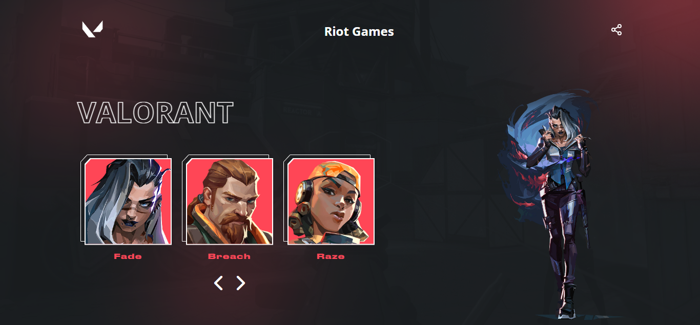

# Desafio 07 da comunidade Codelândia no Discord

## 💻 _valorant_

Repositório criado para armazenar o desafio 07 proposto por Iuri Silva criador da comunidade Codelândia no Discord.

## 💻  Projeto desenvolvido
<a href="https://gabrieldiasdev.github.io/valorant/" target="_blank">Acesse o projeto</a>

## 💡  Info

O projeto contém uma interface moderna e dinâmica para apresentar os agentes do jogo Valorant por meio de uma api pública ! <a href="https://valorant-api.com;" target="_blank">Link da api</a>

## 💻 Tecnologias/Pacotes utilizados

**Frontend**
- HTML
- CSS
- Javascript
- SwiperJS
- FontAwesome

## 👨‍💻 Autor

Gabriel Dias Catarin, desenvolvedor web | Bauru, São Paulo

[ LinkedIn](https://www.linkedin.com/in/gabriel-dias-260857207/)
&nbsp;